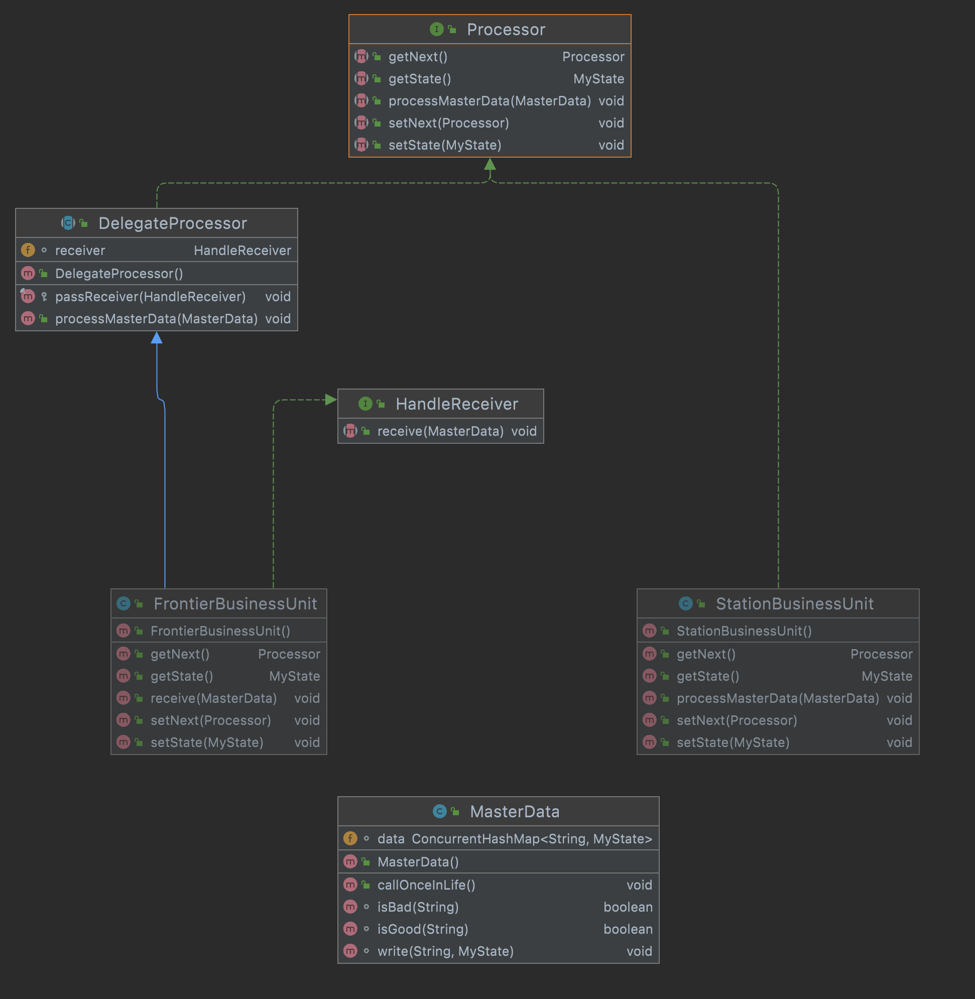

# Interview topics

* OOP
* SOLID
* Database/Streaming

# Pair Programming
We will analyze this design among interview

# Getting Started

### Reference Documentation

For further reference, please consider the following sections:

* [Official Apache Maven documentation](https://maven.apache.org/guides/index.html)
* [Spring Boot Maven Plugin Reference Guide](https://docs.spring.io/spring-boot/docs/2.5.5/maven-plugin/reference/html/)
* [Create an OCI image](https://docs.spring.io/spring-boot/docs/2.5.5/maven-plugin/reference/html/#build-image)
* [Spring for Apache Kafka](https://docs.spring.io/spring-boot/docs/2.5.5/reference/htmlsingle/#boot-features-kafka)
* [Spring Web](https://docs.spring.io/spring-boot/docs/2.5.5/reference/htmlsingle/#boot-features-developing-web-applications)
* [Rest Repositories](https://docs.spring.io/spring-boot/docs/2.5.5/reference/htmlsingle/#howto-use-exposing-spring-data-repositories-rest-endpoint)
* [Spring Data JDBC](https://docs.spring.io/spring-data/jdbc/docs/current/reference/html/)

### Guides

The following guides illustrate how to use some features concretely:

* [Using Apache Camel with Spring Boot](https://camel.apache.org/camel-spring-boot/latest/spring-boot.html)
* [Building a RESTful Web Service](https://spring.io/guides/gs/rest-service/)
* [Serving Web Content with Spring MVC](https://spring.io/guides/gs/serving-web-content/)
* [Building REST services with Spring](https://spring.io/guides/tutorials/bookmarks/)
* [Accessing JPA Data with REST](https://spring.io/guides/gs/accessing-data-rest/)
* [Accessing Neo4j Data with REST](https://spring.io/guides/gs/accessing-neo4j-data-rest/)
* [Accessing MongoDB Data with REST](https://spring.io/guides/gs/accessing-mongodb-data-rest/)
* [Using Spring Data JDBC](https://github.com/spring-projects/spring-data-examples/tree/master/jdbc/basics)

